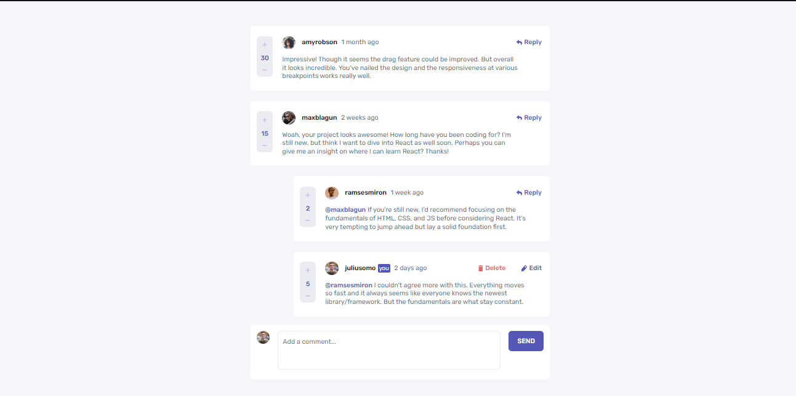
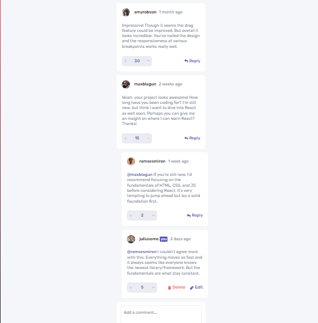

# Frontend Mentor - Interactive comments section solution

Esta es un solucion para [Interactive comments section challenge on Frontend Mentor](https://www.frontendmentor.io/challenges/interactive-comments-section-iG1RugEG9). Los retos Frontend Mentor ayudan a mejorar las habilidades de codificación mediante la creación de proyectos realistas.

## Table of contents

- [Overview](#overview)
  - [The challenge](#the-challenge)
  - [Screenshot](#screenshot)
  - [Links](#links)
- [My process](#my-process)
  - [Built with](#built-with)
- [Author](#author)

## Overview

### The challenge

Los usuarios deben ser capaces de:

- Ver el diseño óptimo para la aplicación según el tamaño de pantalla de su dispositivo
- Ver estados de desplazamiento para todos los elementos interactivos en la página
- Crear, leer, actualizar y eliminar comentarios y respuestas
- Comentarios positivos y negativos
- **Bonus**: si está creando un proyecto puramente frontal, use `localStorage` para guardar el estado actual en el navegador que persiste cuando se actualiza el navegador.
- **Bonus**: en lugar de usar las cadenas `createdAt` del archivo `data.json`, intente usar marcas de tiempo y realice un seguimiento dinámico del tiempo transcurrido desde que se publicó el comentario o la respuesta.

### Screenshot

### Links

- Solution URL: [Github.com](https://github.com/Yosoyteamc/interactive-comments-section-main.git)
- Live Site URL: [Github Pages](https://yosoyteamc.github.io/interactive-comments-section-main/)

## My process

### Built with

- Semantic HTML5 markup
- CSS custom properties
- Flexbox
- Mobile-first workflow
- [SASS](https://sass-lang.com) - For styles

## Author

- Linkedin - [Juan Mosquera](https://www.linkedin.com/in/juanmosquera98/)
- Frontend Mentor - [@yosoyteamc](https://www.frontendmentor.io/profile/Yosoyteamc)
- Instagram - [@yosoyteamc](https://www.instagram.com/yosoyteamc/)
